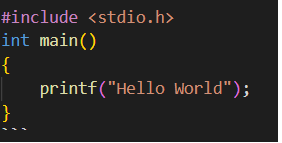

# Demo

This is the Demo for adding contents in github repository

## Github

Super commit

## PROGRAM:
```c
#include <stdio.h>
int main()
{
    printf("Hello World");
}
```
## OUTPUT


## RESULT 
    Thus, the output is verified.